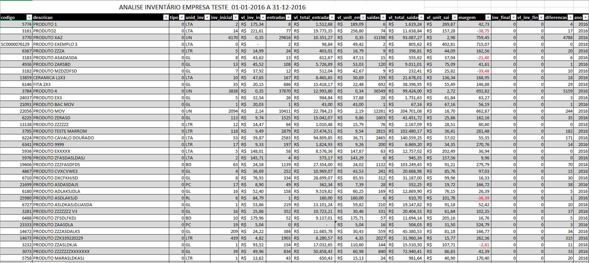

# Analise e Auditoria EFD Fiscal em Go
[](https://travis-ci.org/chapzin/parse-efd-fiscal)
[](https://goreportcard.com/report/github.com/chapzin/parse-efd-fiscal)
[](https://tldrlegal.com/license/mit-license)
[](https://gitter.im/GoAuditoriaFiscal/Lobby?utm_source=share-link&utm_medium=link&utm_campaign=share-link)
[](https://www.paypal.com/cgi-bin/webscr?cmd=_s-xclick&hosted_button_id=R673QGW2LQVCJ)

Projeto voltado para fazer o mapeamento e parse do sped fiscal para dentro do banco de dados


## O que é o Sped Fiscal?
A Escrituração Fiscal Digital - EFD é um arquivo digital, que se constitui de um conjunto de escriturações de documentos fiscais e de outras informações de interesse dos Fiscos das unidades federadas e da Secretaria da Receita Federal do Brasil, bem como de registros de apuração de impostos referentes às operações e prestações praticadas pelo contribuinte.
Este arquivo deverá ser assinado digitalmente e transmitido, via Internet, ao ambiente Sped.

###### SITE OFICIAL DO SPED: http://sped.rfb.gov.br/

## Como compilar 
```
clonar o projeto
Acessar pasta do projeto
go build
```

## Como utilizar
- Edite o arquivo cofing/config.cfg e adicione as configurações de conexão do banco de dados mysql
- Crie o banco de dados que pretende adicionar as informacoes dos xmls e speds
- Adicione todos xmls próprios e speds do periodo onde pretende fazer a importação na pasta speds
Depois de feito esse processo basta executar o programa com a flag -schema que ele cria toda estrutura do banco de dados.
```
parse-efd-fiscal -schema -importa
parse-efd-fiscal -inventario -ano=2016
parse-efd-fiscal -excel
```
Depois disso sera criado um arquivo com o nome AnaliseInventario.xlsx na pasta que foi executado.

## Funcionalidades que serão desenvolvidas no sistema:
- Importar todos Speds e Xmls de um determinado CNPJ para um banco de dados relacional;
- Fazer o processamento da movimentação desse CNPJ e apontar as diferenças dos estoques e criar um arquivo no layout do sped com a sugestão do estoque inicial e do estoque final para fica correto; (microservico)
- Fazer analise de acordo com os feitos pelo fiscos estaduais e apontar possiveis correções; (microservico)
- Fazer comunicação com o sistema Fix Auditoria (http://www.fixauditoria.com.br) e importar automaticamente todos os xmls e speds;
- Enviar relatórios e arquivos dos novos inventários por email;

## Motivação
Não é segredo que no mundo Fiscal existe uma enorme complexidade, com mudanças e atualizações na legislação. O calendário fiscal das empresas é lotado de obrigações a serem cumpridas, com datas definidas pelo FISCO.

Muitas vezes, as obrigações são entregues com a premissa de cumprimento de prazo e a qualidade da informação acaba ficando em segundo plano. Dessa forma, as necessidades das retificações se acumulam e faz com que o mês inicie com “dias faltando”.

Além de ter o importantíssimo papel de atender todas as exigências estabelecidas pelo FISCO Municipal, Estadual e Federal, muitas vezes o setor fiscal das empresas acaba tendo que corrigir tudo o que saiu ou entrou errado durante o mês.

O principal objetivo do sistema é facilitar que as empresas possam fazer um analise da qualidade das informações enviadas, com isso podendo fazer retificações de forma voluntária evitando receber uma multa muito alta.

## Dúvidas?

Abra um issue na página do projeto no GitHub ou [clique aqui](https://github.com/chapzin/parse-efd-fiscal/issues).

## Donate
Ajude a acabar com as injustiça feita pela SEFAZ devido a tantas obrigações a serem entregues.

Donate via [PayPal](https://www.paypal.com/cgi-bin/webscr?cmd=_s-xclick&hosted_button_id=R673QGW2LQVCJ)

## Colaboradores

FixAuditoria - www.fixauditoria.com.br
- Ricardo Gomes (https://github.com/chapzin)
- Junior Holanda (https://github.com/holandajunior)
- Cesar Gimenes (https://github.com/crgimenes)

## License

The project Go Auditoria Fiscal is available under the [MIT license](LICENSE).

## Imagem exemplo da planilha gerada


