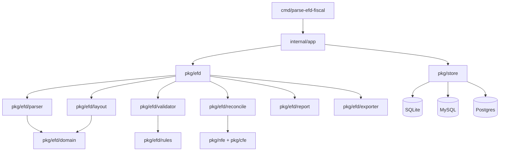

# Plano Mestre: parse-efd-fiscal como biblioteca completa de EFD ICMS/IPI

Data: 2026-05-06
Status: proposto
Escopo: transformar o projeto de um CLI de auditoria de inventário em uma biblioteca, CLI e plataforma auditável para leitura, validação, reconciliação e geração de EFD ICMS/IPI/SPED Fiscal.

## 1. Essência da ideia original

O projeto nasceu para resolver uma dor fiscal real: empresas entregam SPED Fiscal sob pressão, com risco de inconsistências entre escrituração, XMLs fiscais, estoque físico, inventário e regras estaduais. A essência não é apenas "parsear arquivo". A essência é **dar confiança fiscal antes da entrega ou retificação**, com evidência auditável e sugestão de correção.

A versão completa deve responder quatro perguntas para o usuário:

1. O arquivo SPED está estruturalmente correto conforme o leiaute aplicável?
2. O conteúdo está coerente com XMLs, inventário, cadastro de produtos, CFOP/CST/NCM, apurações e regras por UF/período?
3. O que precisa ser corrigido, com prioridade, impacto e prova?
4. É possível exportar relatórios e arquivos de correção confiáveis sem expor dados sensíveis?

## 2. Fontes de verdade e pesquisa externa

Fontes oficiais e contexto usado nesta análise:

- Portal SPED, projeto EFD ICMS/IPI: `http://sped.rfb.gov.br/projeto/show/274`.
- Guia Prático EFD ICMS/IPI versão 3.1.9: `http://sped.rfb.gov.br/item/show/7818`.
- O portal informa downloads, PVA/Validador EFD ICMS/IPI, manuais, guias práticos, perguntas frequentes e notas técnicas.
- Resultado de pesquisa: guia 3.1.9 com vigência futura e menções a leiaute versão 020/Nota Técnica 2025.001 para 2026.
- Pesquisa de mercado/conteúdo técnico mostra dores recorrentes: inventário Bloco H, cruzamento XML x SPED, risco de autuação, obrigações acessórias, Bloco K, apuração ICMS/IPI, prazos e retificações.

Fontes internas:

- `README.md`: proposta de auditoria EFD, importação SPED/XML, inventário, Excel, integração Fix Auditoria e relatórios.
- `memory-bank/projectbrief.md`: objetivos de automação, inconsistências, inventário corrigido e relatórios.
- `memory-bank/productContext.md`: dores de negócio, prevenção de multas, economia de tempo e evidência auditável.
- `memory-bank/systemPatterns.md`: arquitetura CLI, controllers, models, DB, importação, inventário.
- Código atual: `main.go`, `read/`, `exec/`, `Models/`, `SpedDB/`, `Controllers/`.

## 3. Estado atual auditado

### 3.1 O que já existe

- CLI com flags: `-schema`, `-importar-sped`, `-importar-xml`, `-inventario`, `-anoInicial`, `-anoFinal`, `-excel`, `-h010`, `-cnpj`.
- Importação SPED por diretório em `read/sped.go`.
- Importação XML NFe/CFe em `read/xml.go` e `exec/xml_*.go`.
- Modelos tipados parciais para:
  - Bloco 0: `0000`, `0150`, `0190`, `0200`, `0220`.
  - Bloco C: `C100`, `C170`, `C400`, `C405`, `C420`, `C425`, `C460`, `C465`, `C470`, `C490`, `C800`, `C860`, `C870`, `C890`.
  - Bloco H: `H005`, `H010`.
- Switch reconhece muitos registros em `exec/sped.go`, mas a maioria está vazia.
- Persistência GORM v1 e schema via `SpedDB/`.
- Processamento de inventário e relatório Excel em `Controllers/InventarioController.go`.
- Testes em `tools/` e `read/sped_test.go`.

### 3.2 Lacunas principais

- Não há catálogo versionado de leiaute.
- Não há cobertura completa dos blocos/registros EFD ICMS/IPI.
- Parser acopla leitura, estado, criação de structs e persistência.
- Tipos fiscais ainda são primitivos soltos (`string`, `float64`, `time.Time`) sem semântica forte de CNPJ, IE, CFOP, CST, NCM, moeda, quantidade, data SPED, chave NFe.
- Validações fiscais são pontuais e misturadas nos models.
- Banco é obrigatório para quase tudo, dificultando uso como biblioteca.
- Não há migrations versionadas, golden tests de SPED completo, fuzz tests, fixtures oficiais/sintéticas e integração com PVA.
- Segurança e LGPD precisam ser tratadas como requisito central por haver XML/SPED e dados fiscais reais.

## 4. Produto-alvo

Nome conceitual: **Parse EFD Fiscal Platform**.

Entregáveis finais:

1. **Biblioteca Go** para parse, validação, normalização, reconciliação e geração de EFD ICMS/IPI.
2. **CLI profissional** para usuários fiscais e automação CI/CD.
3. **Camada de persistência opcional** com SQLite/MySQL/Postgres.
4. **Motor de regras versionado** por leiaute, UF, período, regime e perfil.
5. **Relatórios auditáveis** em JSON, CSV, Excel e HTML.
6. **Gerador de código** a partir de catálogo oficial/versionado de registros e campos.
7. **API local/serviço** opcional para integrações e dashboard.
8. **Pacote de fixtures sintéticas** sem dados sensíveis.

## 5. Arquitetura-alvo



### 5.1 Pacotes propostos

- `pkg/efd`: API pública principal.
- `pkg/efd/domain`: tipos ricos, registros, blocos e entidades fiscais.
- `pkg/efd/layout`: catálogo versionado de leiautes, registros, campos, obrigatoriedade e validações estruturais.
- `pkg/efd/parser`: parser streaming, tolerante a Latin-1/UTF-8, com erros ricos por linha/campo.
- `pkg/efd/serializer`: escrita de arquivo SPED com ordenação, contadores e bloco 9.
- `pkg/efd/validator`: validações estruturais, semânticas e fiscais.
- `pkg/efd/rules`: regras por versão, UF, período, perfil, regime e finalidade.
- `pkg/efd/reconcile`: cruzamentos SPED x XML x inventário x cadastro.
- `pkg/efd/report`: relatórios JSON/CSV/Excel/HTML.
- `pkg/efd/exporter`: exportações corretivas, incluindo Bloco H/H010/H020.
- `pkg/nfe`, `pkg/cfe`, `pkg/cte`: leitores XML separados por documento fiscal.
- `pkg/store`: persistência opcional com interfaces.
- `internal/legacy`: adaptação gradual do código atual.
- `cmd/parse-efd-fiscal`: CLI nova.

### 5.2 API pública inicial

```go
package efd

type ParseOptions struct {
    LayoutVersion string
    Encoding      Encoding
    ExpectedCNPJ  CNPJ
    Strict        bool
    MaxLineBytes  int
}

type Document struct {
    LayoutVersion string
    Header        *Reg0000
    Blocks        Blocks
    Diagnostics   []Diagnostic
}

func Parse(r io.Reader, opts ParseOptions) (*Document, error)
func Validate(ctx context.Context, doc *Document, opts ValidateOptions) Report
func Serialize(w io.Writer, doc *Document, opts SerializeOptions) error
```

## 6. Tipagem fiscal forte

Substituir progressivamente primitivos por tipos com validação e formatação:

| Tipo Go | Base | Uso | Regras |
|---|---:|---|---|
| `CNPJ` | string | contribuinte/emitente/destinatário | 14 dígitos, normalização, validação opcional de dígito |
| `CPF` | string | participante pessoa física | 11 dígitos |
| `IE` | string | inscrição estadual | regra por UF opcional |
| `UF` | string | unidade federativa | enum AC..TO/EX |
| `MunicipioIBGE` | string | COD_MUN | 7 dígitos |
| `NCM` | string | classificação fiscal | 8 dígitos, tabela externa versionada |
| `CFOP` | string | operação fiscal | 4 dígitos, tabela/UF/período |
| `CSTICMS`, `CSOSN`, `CSTIPI`, `CSTPISCOFINS` | string | tributação | enums versionados |
| `ChaveNFe` | string | CHV_NFE | 44 dígitos, DV |
| `DataSped` | time.Time | DDMMAAAA | sem timezone |
| `Periodo` | struct | mês/ano ou data início/fim | coerência entre registros |
| `Decimal` | decimal.Decimal | moeda/quantidade/base/aliquota | nunca usar `float64` para novos modelos |
| `Quantidade` | Decimal | QTD | escala configurável por campo |
| `Valor` | Decimal | VL_* | escala 2 ou conforme guia |
| `Aliquota` | Decimal | ALIQ_* | escala 2/4 conforme campo |
| `CodigoItem` | string | COD_ITEM | preserva zeros à esquerda |
| `Indicador` | string enum | IND_* | enum por campo |

Biblioteca decimal recomendada: `github.com/shopspring/decimal` ou tipo próprio baseado em `math/big.Rat`. Decisão final deve considerar performance e serialização.

## 7. Estratégia para todos os campos e registros do SPED

A forma correta de implementar "todos os campos detalhadamente" é **não escrever structs manualmente como hoje**. O plano é criar um catálogo versionado, revisável e gerador de código.

### 7.1 Catálogo de leiaute

Criar `layouts/efd-icms-ipi/<versao>/catalog.yaml`:

```yaml
version: "020"
guide: "3.1.9"
effective_from: "2026-01-01"
blocks:
  - id: "0"
    records:
      - code: "0000"
        name: "Abertura do arquivo digital e identificação da entidade"
        level: 0
        occurrence: "one"
        fields:
          - index: 1
            name: "REG"
            type: "Fixed"
            literal: "0000"
            required: true
          - index: 2
            name: "COD_VER"
            type: "LayoutCode"
            required: true
          - index: 3
            name: "COD_FIN"
            type: "Enum"
            enum: "CodFinalidadeArquivo"
            required: true
          - index: 4
            name: "DT_INI"
            type: "DataSped"
            required: true
          - index: 5
            name: "DT_FIN"
            type: "DataSped"
            required: true
          - index: 6
            name: "NOME"
            type: "String"
            max_length: 100
            required: true
          - index: 7
            name: "CNPJ"
            type: "CNPJ"
            required_if_empty: "CPF"
          - index: 8
            name: "CPF"
            type: "CPF"
            required_if_empty: "CNPJ"
```

### 7.2 Geração de código

Criar `cmd/efdgen` para gerar:

- `pkg/efd/domain/reg_0000_gen.go` com struct tipada.
- `pkg/efd/domain/reg_0000_validate_gen.go` com validações estruturais.
- `pkg/efd/layout/catalog_gen.go` com metadados runtime.
- `pkg/store/migrations/<version>.sql` para schema.
- Documentação Markdown de campos por registro.

Exemplo gerado:

```go
type Reg0000 struct {
    Reg       Fixed0000        `sped:"1" db:"reg"`
    CodVer    LayoutCode       `sped:"2" db:"cod_ver"`
    CodFin    CodFinalidade    `sped:"3" db:"cod_fin"`
    DtIni     DataSped         `sped:"4" db:"dt_ini"`
    DtFin     DataSped         `sped:"5" db:"dt_fin"`
    Nome      Texto            `sped:"6" db:"nome" max:"100"`
    CNPJ      CNPJ             `sped:"7" db:"cnpj"`
    CPF       CPF              `sped:"8" db:"cpf"`
    UF        UF               `sped:"9" db:"uf"`
    IE        IE               `sped:"10" db:"ie"`
    CodMun    MunicipioIBGE    `sped:"11" db:"cod_mun"`
    IM        Texto            `sped:"12" db:"im" max:"15"`
    SUFRAMA   Texto            `sped:"13" db:"suframa" max:"9"`
    IndPerfil PerfilEFD        `sped:"14" db:"ind_perfil"`
    IndAtiv   Atividade        `sped:"15" db:"ind_ativ"`
}
```

## 8. Cobertura de blocos/registros

A cobertura deve seguir o Guia Prático por versão. O switch atual já lista grande parte dos registros, mas só implementa pequena parcela. A meta é cobertura por blocos:

### Bloco 0: abertura, identificação e cadastros

Prioridade máxima. Base para validações de CNPJ, participante, item, unidade, conversão, contador, informações complementares.

Registros prioritários: `0000`, `0001`, `0005`, `0015`, `0100`, `0150`, `0175`, `0190`, `0200`, `0205`, `0206`, `0210`, `0220`, `0300`, `0305`, `0400`, `0450`, `0460`, `0500`, `0600`, `0990`.

### Bloco C: documentos fiscais mercadorias ICMS/IPI

Prioridade máxima. É o centro do cruzamento XML, CFOP/CST, itens, NFC-e/SAT, apuração e estoque.

Registros prioritários: `C001`, `C100`, `C101`, `C105`, `C110`, `C111`, `C112`, `C113`, `C114`, `C115`, `C116`, `C120`, `C130`, `C140`, `C141`, `C160`, `C165`, `C170`, `C171`, `C172`, `C173`, `C174`, `C175`, `C176`, `C177`, `C178`, `C179`, `C190`, `C195`, `C197`, `C300`, `C310`, `C320`, `C321`, `C350`, `C370`, `C390`, `C400`, `C405`, `C410`, `C420`, `C425`, `C460`, `C465`, `C470`, `C490`, `C495`, `C500`, `C510`, `C590`, `C600`, `C601`, `C610`, `C690`, `C700`, `C790`, `C791`, `C800`, `C850`, `C860`, `C870`, `C890`, `C990`.

### Bloco D: transporte e comunicação

Prioridade alta para empresas com CT-e, transporte, frete, comunicação/telecom.

Registros: `D001`, `D100`, `D101`, `D110`, `D120`, `D130`, `D140`, `D150`, `D160`, `D161`, `D162`, `D170`, `D180`, `D190`, `D195`, `D197`, `D300`, `D301`, `D310`, `D350`, `D355`, `D360`, `D365`, `D370`, `D390`, `D400`, `D410`, `D411`, `D420`, `D500`, `D510`, `D530`, `D590`, `D600`, `D610`, `D690`, `D695`, `D697`, `D990`.

### Bloco E: apuração ICMS/IPI

Prioridade máxima para auditoria fiscal. Sem ele a análise não fecha imposto.

Registros: `E001`, `E100`, `E110`, `E111`, `E112`, `E113`, `E115`, `E116`, `E200`, `E210`, `E220`, `E230`, `E240`, `E250`, `E300`, `E310`, `E311`, `E312`, `E313`, `E316`, `E500`, `E510`, `E520`, `E530`, `E990`.

### Bloco G: CIAP

Prioridade média/alta para empresas com ativo imobilizado e crédito de ICMS.

Registros: `G001`, `G110`, `G125`, `G126`, `G130`, `G140`, `G990`.

### Bloco H: inventário físico

Prioridade máxima para a essência atual do projeto.

Registros: `H001`, `H005`, `H010`, `H020`, `H990`.

### Bloco K: controle de produção e estoque

Prioridade alta, especialmente indústria. Deve ser implementado com cuidado por alta sensibilidade fiscal.

Registros: `K001`, `K100`, `K200`, `K210`, `K215`, `K220`, `K230`, `K235`, `K250`, `K255`, `K260`, `K265`, `K270`, `K275`, `K280`, `K290+` conforme versões atuais, `K990`.

### Bloco 1: outras informações

Prioridade média/alta por complementar apurações, exportação, energia, combustível e informações estaduais.

Registros: `1001`, `1010`, `1100`, `1105`, `1110`, `1200`, `1210`, `1300`, `1310`, `1320`, `1350`, `1360`, `1370`, `1390`, `1391`, `1400`, `1500`, `1510`, `1600`, `1700`, `1710`, `1800`, `1900`, `1910`, `1920`, `1921`, `1922`, `1923`, `1925`, `1926`, `1990`.

### Bloco 9: controle e encerramento

Prioridade máxima para serialização e validação estrutural.

Registros: `9001`, `9900`, `9990`, `9999`.

## 9. Motor de validação

### 9.1 Classes de validação

1. **Estrutural**: quantidade de campos, tipo, tamanho, obrigatoriedade, literal `REG`, hierarquia de registros.
2. **Referencial**: `COD_ITEM` existe no `0200`, `COD_PART` existe no `0150`, unidade existe no `0190`, participante/documento/itens coerentes.
3. **Período**: datas dentro de `0000.DT_INI`/`DT_FIN`, apurações coerentes com mês.
4. **Fiscal básica**: CFOP por entrada/saída, CST/CSOSN compatível, NCM válido, chave NFe válida, COD_SIT compatível.
5. **Cruzamentos**: SPED x XML, C100 x C170, C190 x C170, apuração E x documentos C/D, inventário H x movimentação C/D/K.
6. **Regras estaduais**: plugin por UF e período.
7. **Regressão PVA**: exportar arquivo e comparar diagnósticos com PVA quando possível.

### 9.2 Diagnóstico padrão

```go
type Diagnostic struct {
    Severity   Severity // Info, Warning, Error, Fatal
    Code       string
    Message    string
    RecordCode string
    Line       int
    Field      string
    Value      string
    Evidence   []Evidence
    Suggestion string
}
```

## 10. Reconciliações de maior valor

1. **XML NFe/CFe x SPED C100/C170/C800/C860**:
   - notas ausentes;
   - itens divergentes;
   - valores divergentes;
   - CFOP/CST/NCM divergentes;
   - canceladas/denegadas/inutilizadas.

2. **Inventário Bloco H x movimentação**:
   - estoque inicial + entradas - saídas = estoque final;
   - conversão de unidades `0220`;
   - valor unitário médio;
   - sugestão H010/H020;
   - divergência por item, NCM, CFOP.

3. **Cadastro 0200 x XML/produtos**:
   - descrição/NCM/unidade/código divergente;
   - EAN ausente ou inconsistente;
   - itens movimentados não cadastrados.

4. **Apuração Bloco E x documentos**:
   - bases e ICMS por CST/CFOP/UF;
   - débitos/créditos e ajustes;
   - obrigações a recolher.

5. **Bloco K produção/estoque**:
   - consumo específico;
   - produção acabada;
   - perdas e substituições;
   - saldo escritural.

## 11. CLI-alvo

Migrar para Cobra/Viper ou manter `flag` apenas na fase inicial. CLI desejada:

```bash
parse-efd-fiscal parse arquivo.txt --layout 019 --out parsed.json
parse-efd-fiscal validate arquivo.txt --layout auto --uf GO --periodo 2025-01
parse-efd-fiscal import ./speds --db sqlite://efd.db --cnpj 12345678000190
parse-efd-fiscal reconcile --sped ./speds --xml ./xmls --out relatorio.xlsx
parse-efd-fiscal inventory audit --ano-inicial 2020 --ano-final 2024 --out inventario.xlsx
parse-efd-fiscal export h010 --ano 2024 --out SpedInvFinal.txt
parse-efd-fiscal layout list
parse-efd-fiscal layout describe C170 --version 019
parse-efd-fiscal report html --db sqlite://efd.db --out site/
```

## 12. Persistência e migrações

### 12.1 Princípios

- Biblioteca deve funcionar sem banco.
- Persistência deve ser plugável.
- Migrations devem ser versionadas e reversíveis.
- Dados sensíveis devem ter política de retenção.

### 12.2 Estratégia

- Fase 1: isolar GORM v1 atrás de interfaces.
- Fase 2: adicionar SQLite para uso local simples.
- Fase 3: migrar para GORM v2 ou SQLC.
- Fase 4: migrations geradas por catálogo de layout.

## 13. Versionamento

### 13.1 Versionamento do software

SemVer:

- `v0.x`: refatoração, API instável, compatibilidade gradual com legado.
- `v1.0.0`: parser streaming estável, catálogo versionado, validação estrutural dos blocos principais, CLI estável.
- `v1.1+`: novos blocos/regras sem quebrar API.
- `v2.0`: breaking changes de API pública, se necessário.

### 13.2 Versionamento de leiaute

Cada versão oficial terá:

- `layouts/efd-icms-ipi/<cod_ver>/catalog.yaml`.
- `effective_from`, `effective_to`, `guide_version`, `nota_tecnica`.
- testes golden por versão.
- changelog do layout.

### 13.3 Versionamento de regras

Regras devem carregar metadados:

```yaml
id: BR-EFD-C170-CFOP-001
uf: ALL
effective_from: 2024-01-01
layout_versions: ["018", "019", "020"]
severity: error
```

## 14. Roadmap de implementação

### Marco 0: segurança, governança e base

Objetivo: não quebrar usuários existentes e preparar o terreno.

Tarefas:

- Criar `docs/roadmap/` e ADRs.
- Criar `SECURITY.md` real.
- Criar `.env.example` sem segredos.
- Criar fixtures sintéticas.
- Adicionar CI GitHub Actions: test, build, lint, race, govulncheck.
- Definir política LGPD: nunca commitar SPED/XML reais.

Critério de aceite:

- `go test ./...`, `go build ./...`, `go test -race ./...` passam.
- CI roda em PR.

### Marco 1: biblioteca parser independente de DB

Tarefas:

- Criar `pkg/efd/parser` streaming.
- Criar `pkg/efd/domain` com tipos fortes base.
- Criar `Diagnostic` e erros por linha/campo.
- Suporte UTF-8/Latin-1/auto.
- Parser preserva ordem e hierarquia.
- Adicionar golden tests.

Critério de aceite:

- Parsear SPED sintético completo sem banco.
- Retornar diagnósticos com linha/campo.

### Marco 2: catálogo versionado e geração de código

Tarefas:

- Criar schema YAML do catálogo.
- Migrar registros atuais para catálogo.
- Criar `cmd/efdgen`.
- Gerar structs, validações estruturais e docs.
- Cobrir Bloco 0, C, H e 9 primeiro.

Critério de aceite:

- Código gerado reproduz campos atuais e adiciona metadados.
- Bloco 9 valida contagens.

### Marco 3: cobertura fiscal essencial

Tarefas:

- Completar Bloco 0.
- Completar Bloco C.
- Completar Bloco H.
- Implementar Bloco 9.
- Serializador SPED com contadores.

Critério de aceite:

- Ler, validar e reescrever arquivo sintético preservando conteúdo lógico.

### Marco 4: reconciliação XML x SPED

Tarefas:

- Separar `pkg/nfe`, `pkg/cfe`.
- Implementar cruzamentos por chave, item, valor, CFOP/CST/NCM.
- Relatórios JSON/Excel com evidência.
- Tratamento de canceladas/denegadas.

Critério de aceite:

- Relatório aponta notas faltantes nos dois sentidos e divergências de itens.

### Marco 5: inventário e Bloco K

Tarefas:

- Refatorar inventário para serviço puro.
- Implementar H005/H010/H020 com decimal.
- Implementar K200/K220/K230/K235/K280 inicialmente.
- Motor de saldo por item/unidade/conversão.

Critério de aceite:

- Auditoria de estoque bate entradas/saídas/inventário em fixtures.

### Marco 6: Blocos D, E, G, 1

Tarefas:

- Implementar D para transporte/comunicação.
- Implementar E para apuração ICMS/IPI.
- Implementar G para CIAP.
- Implementar 1 para complementares.

Critério de aceite:

- Validações de apuração com documentos e ajustes.

### Marco 7: persistência e API

Tarefas:

- Interfaces `Store`.
- SQLite local.
- MySQL/Postgres.
- Migrations versionadas.
- API HTTP opcional.

Critério de aceite:

- Importar base sintética em SQLite e gerar relatórios sem MySQL.

### Marco 8: UX, dashboard e integração

Tarefas:

- Dashboard HTML local.
- Relatórios por severidade, item, CFOP, NCM, período.
- Integração Fix Auditoria se houver contrato/API.
- Exportação de pacotes de evidência.

Critério de aceite:

- Usuário não técnico consegue executar fluxo completo com um comando guiado.

## 15. Critérios de qualidade

- Cobertura mínima de testes por pacote crítico: 80%.
- Fuzz tests para parser de linhas.
- Golden tests por registro e por bloco.
- Testes de integração com banco em containers.
- `go test -race ./...` obrigatório.
- Benchmarks para arquivos grandes.
- Nenhum uso novo de `float64` em valores fiscais.
- Nenhum dado sensível em logs por padrão.

## 16. Riscos e mitigação

| Risco | Impacto | Mitigação |
|---|---|---|
| Mudanças frequentes no guia SPED | alto | catálogo versionado + gerador |
| Regras por UF/período complexas | alto | engine de regras com metadados |
| Dados sensíveis | alto | fixtures sintéticas, redaction, LGPD |
| Divergência com PVA | alto | testes PVA e golden fixtures |
| Performance em arquivos grandes | médio/alto | streaming, batch, benchmarks |
| Código legado acoplado ao DB | médio | adapters e migração incremental |

## 17. Primeiras implementações recomendadas

A próxima sprint deve implementar, nesta ordem:

1. CI GitHub Actions.
2. `.env.example` e `SECURITY.md` real.
3. `pkg/efd/types` com `CNPJ`, `DataSped`, `Decimal`, `CFOP`, `NCM`, `ChaveNFe`.
4. `pkg/efd/parser` mínimo independente de DB.
5. `Diagnostic` e golden tests.
6. Catálogo YAML inicial para `0000`, `0150`, `0190`, `0200`, `0220`, `C100`, `C170`, `H005`, `H010`, `9001`, `9900`, `9990`, `9999`.
7. Gerador `efdgen` simples.

## 18. Definição de pronto do projeto completo

O projeto pode ser considerado completo quando:

- cobre todos os blocos obrigatórios da EFD ICMS/IPI por pelo menos uma versão oficial atual;
- possui catálogo versionado para versões suportadas;
- parseia e serializa SPED sem perda lógica;
- valida estrutura, referências, contagens, apuração e inventário;
- cruza XML x SPED com relatório auditável;
- gera sugestões de correção e exportações SPED quando juridicamente seguro;
- tem CLI estável, biblioteca pública documentada e testes abrangentes;
- protege dados sensíveis por padrão;
- documenta claramente que não substitui o PVA nem consultoria fiscal, mas antecipa inconsistências e gera evidências.
