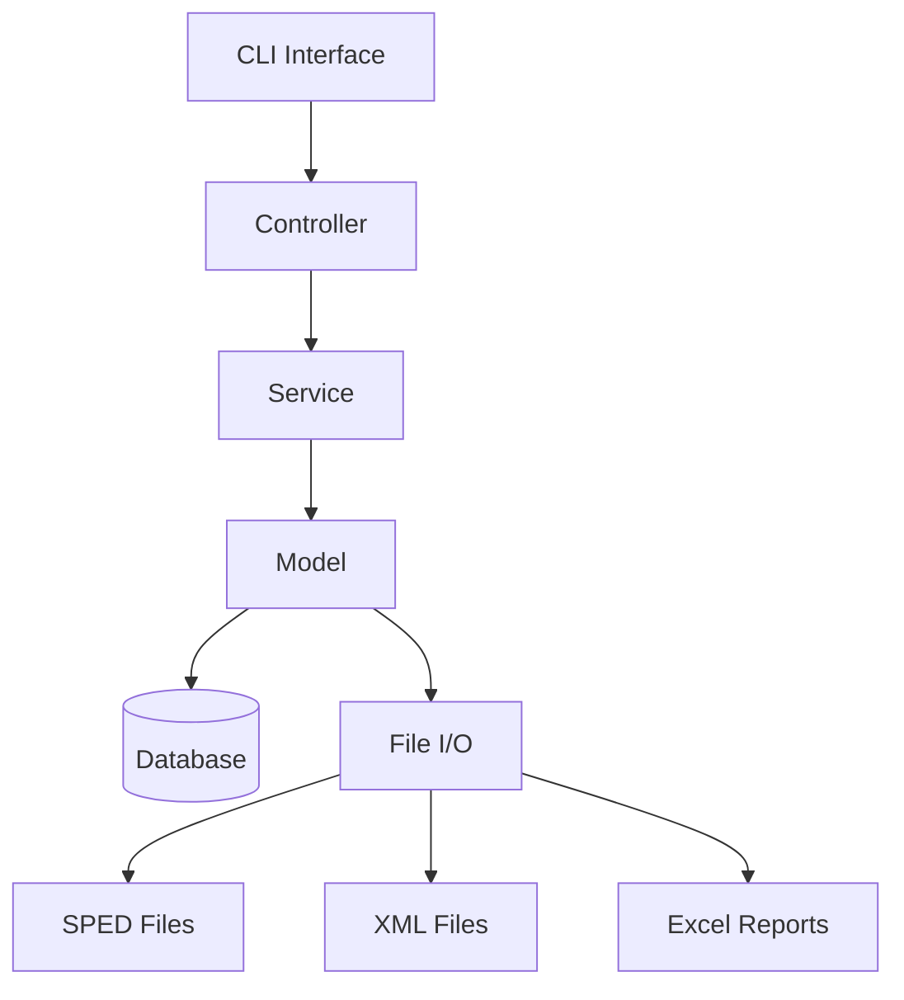
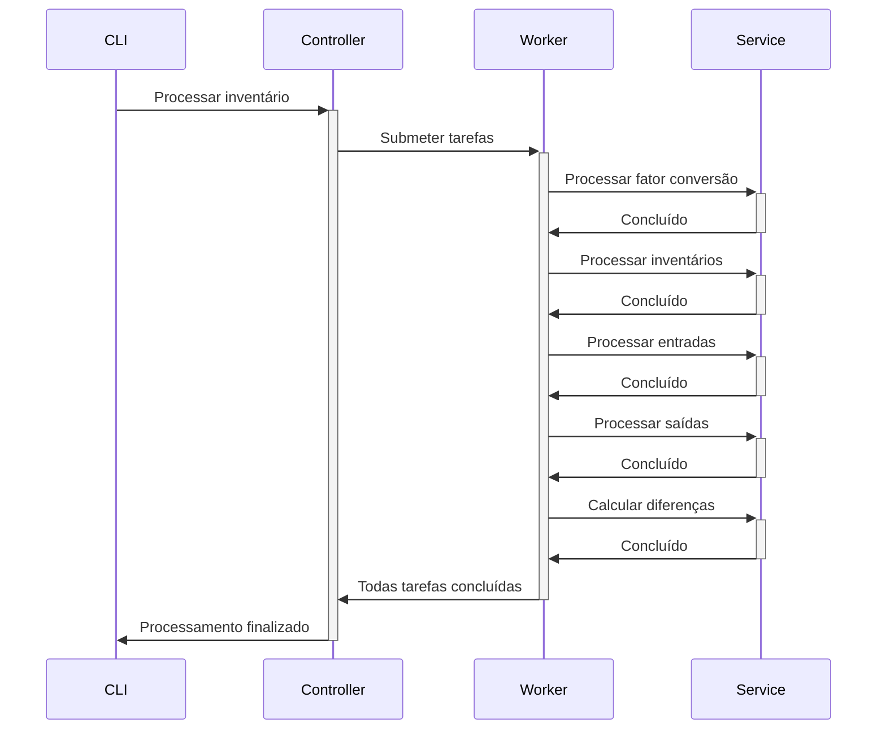

# System Patterns - Parse-EFD-Fiscal

## Arquitetura do Sistema

O Parse-EFD-Fiscal segue uma arquitetura em camadas, com separação clara de responsabilidades. A aplicação é construída como uma ferramenta de linha de comando (CLI) que executa uma série de operações baseadas em flags.



### Componentes Principais

1. **CLI Interface**: Ponto de entrada da aplicação, processa argumentos e direciona o fluxo.
2. **Controllers**: Orquestram operações complexas e coordenam serviços.
3. **Services**: Implementam a lógica de negócio específica para cada operação.
4. **Models**: Representam as estruturas de dados e entidades do sistema.
5. **Database**: Armazena dados processados para análise posterior.
6. **File I/O**: Gerencia leitura e escrita de arquivos SPED, XML e Excel.

## Padrões de Design

### Estrutura MVC Adaptada

O projeto adota uma estrutura inspirada no MVC, com adaptações para um contexto de CLI:

- **Models/**: Define estruturas que representam entidades de negócio (Reg0200, RegC170, etc.)
- **Controllers/**: Contém a lógica de orquestração para operações complexas
- **Services/**: (Implementado em Controllers/service/) - Encapsula a lógica de negócio específica

### Padrão Repository

Utilizado para abstrair o acesso a dados, principalmente em:

- **Controllers/repository/**: Contém interfaces e implementações para acesso ao banco de dados
- Separa a lógica de persistência da lógica de negócio

### Command Pattern

Implementado através do sistema de flags da aplicação, onde cada flag representa um comando específico:

```
parse-efd-fiscal -importar-sped    # Comando para importar SPEDs
parse-efd-fiscal -inventario       # Comando para processar inventário
parse-efd-fiscal -excel            # Comando para gerar relatório Excel
```

### Worker Pool Pattern

Utilizado para processamento paralelo em:

- **pkg/worker/**: Implementa um pool de workers para execução concorrente de tarefas
- Permite melhor utilização de recursos em operações intensivas

### Dependency Injection

Aplicado de forma simples através da passagem explícita de dependências:

```go
func ProcessarInventario(db *gorm.DB, anoInicial, anoFinal int) {}
```

## Fluxos de Dados Principais

### Importação de SPED

```mermaid
sequenceDiagram
    CLI->>+RecursiveSpeds: Processar diretório
    RecursiveSpeds->>+LeituraSped: Ler arquivo SPED
    LeituraSped->>+Parser: Interpretar linha
    Parser->>-Models: Criar instância
    Models->>-DB: Persistir
    LeituraSped->>-RecursiveSpeds: Próximo arquivo
    RecursiveSpeds->>-CLI: Finalizado
```

### Processamento de Inventário



## Relações entre Componentes

### Hierarquia de Modelos

Os modelos seguem a estrutura do SPED Fiscal, organizados por blocos:

- **Models/Bloco0/**: Registros de abertura e identificação (Reg0000, Reg0200, etc.)
- **Models/BlocoC/**: Documentos fiscais (RegC100, RegC170, etc.)
- **Models/BlocoH/**: Inventário físico (RegH005, RegH010, etc.)
- **Models/NotaFiscal/**: Representação de NFe a partir de XMLs
- **Models/Inventario.go**: Modelo central para análise de inconsistências

### Dependências Externas

- **github.com/jinzhu/gorm**: ORM para acesso ao banco de dados
- **github.com/tealeg/xlsx**: Manipulação de arquivos Excel
- **github.com/joho/godotenv**: Carregamento de variáveis de ambiente

## Decisões Arquiteturais Chave

1. **Separação em Fases**: O processamento de inventário é dividido em fases para melhor gerenciamento de dependências.
2. **Persistência Completa**: Todos os registros SPED são persistidos no banco para análises complexas.
3. **Processamento Paralelo**: Operações independentes são executadas concorrentemente para otimização.
4. **Orientação a CLI**: Interface primária via linha de comando para automação e integração. 